# Tópicos sobre Desenho de Soluções

## Conteúdo dos módulos de treinamento

### Bizagi: mapeamento de processos com BPMN

#### 1.0 Por que aprender Bizagi com BPMN

- BPMN (Business Process Model and Notation) Notação para Mudelagem de Processos de Negócios

- [Guia Rápido BPMN](https://www.bpmn.org)

- BPMN busca analisar e representar requisitos de maneira padronizada. Desenha os processos e propõe melhorias numa linguagem clara.

- Etapas para começar o desenho do BPMN:

    - Identificar os requisitos (texto corrido para entender a demanda)
    - Análise lógica dos requisitos
    - Montagem do diagrama inicial de como está o processo "As Is"

- Dowload da ferramenta Bizagi

- Processo "As Is" (situação atual):

    - Processo é um método, sistema ou forma de agir aplicado sequencialmente de forma lógica para atingir um objetivo.

    - BPMN é a linguagem de modelagem gráfica.

        -  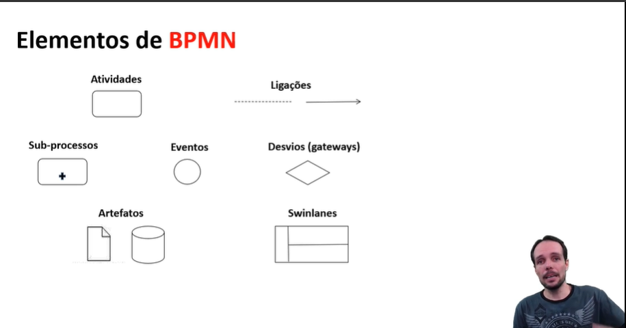

#### 2.0 Atividades, ligações e subprocessos

- Elementos do BPMN:

    - Atividade (Retângulo com borda curva) - São tarefas que são executadas de maneira sequencial dentro de um contexto para atingir um determinado objetivo. Então, são atividades, são tarefas, são ações que você realiza no seu dia a dia, independente da nomenclatura.

    - Ligações (Linahs setas) - Serve para representar a conexão de uma sequência de ações, fluxo de mensagens, e/ou associar diferentes elementos de BPMN

    - Subprocessos (Retângulo com borda curva e um + abaixo) - Subprocesso é uma demanda clara de representar alguma coisa que herda de um processo pai. É um grupo de elementos de BPMN que podem ser representados de maneira agrupada (colapsada) sem perda de informação e entendimento do processo principal que esta sendo modelado.

- [Fome de Poder - Processo](https://www.youtube.com/watch?v=8Xt63PHuMqU)

#### 3.0 Eventos e Desvios

- Elementos do BPMN:

    - Evento (Círculo) - É algo que acontece e influência no meu processo.

    - Desvio / Gateway (Losângo) - São pontos que você vai convergir e você vai precisar tomar decisão ou visualizar caminhos.

    [Gestão de Processos](https://www.youtube.com/watch?v=465nRz_0qpw)

#### 4.0 Artefatos e Swimlanes

- Elementos do BPMN:

    - Artefato (Documento e pilha) - São que objetos, dados, repositórios. São elementos externos ao teu contexto do processo, que você vai fazer uma consulta e que ele vai gerar alguma ação dentro do teu contexto, do teu processo.

    - Swimlanes (Blocos de raias de processos) - É uma área que delimita um espaço organizacional. Então você pode representar uma entidade, que pode ser uma empresa, pode ser um departamento, pode ser um setor, enfim, um grupo de pessoas que foi instituído em uma estrutura projetizada, então, é uma entidade. Você representa uma entidade.

#### 5.0 Modelagem Bizagi para BPMN

- Resumo:

    - As Is é como está o processo hoje e TO BE é como ficará o processo após ser remodelado.

### UML: modelagem de soluções

#### 1.0 Visão inicial UML

- UML (Linguagem de Modelagem Unificada) - A UML se baseia na Orientação a Objetos.

- Ferramentas grátis de UML:

    - [Astah](http://astah.net/editions/community)

    - [ArgoUML](https://github.com/argouml-tigris-org)

- Ferramentas pagas de UML:

    - [Sparx](http://www.sparxsystems.com/)

    - [Draw io](http://draw.io)

#### 2.0 Diagramas de Caso de Uso

- Diagrama de Caso de Uso: Documento que comunica o que o sistema faz do ponto de vista do usuário.

    - Ator: Personagem das interações com as funcionalidades
    - Casos: Funcionalidades
    - Esteriótipos: Informações de ligações entre os casos
    - Comunicação: As setas que ligam os atores com as funcionalidades

    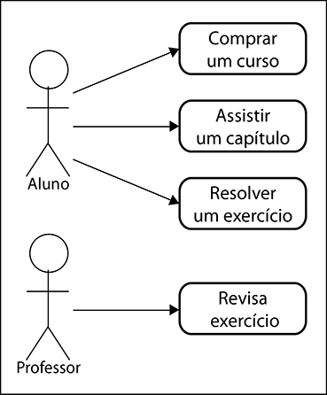

#### 3.0 Diagramas de Classes

- Diagrama de Classes: Documento que comunica com a equipe de desenvolvimento, baseando suas classes na Orientação a Objeto.

    - Sinal de menos - Privado
    - Sinal de mais - Público

    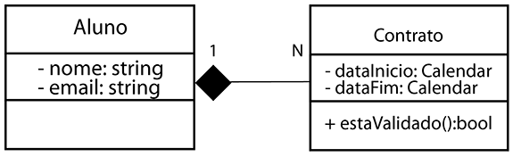

#### 4.0 Diagrama de Sequência

- Diagrama de Sequência: Documento que comunica fluxos de negócios, que são geralmente um pouco mais complexos.

    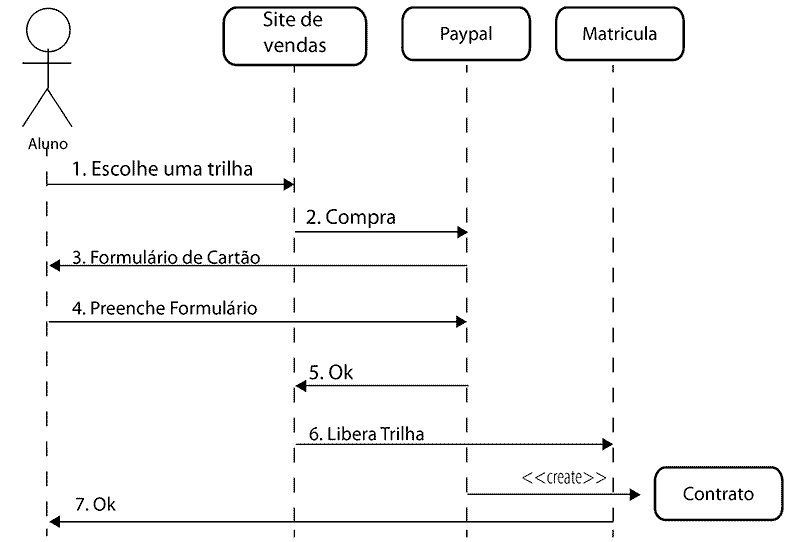

#### 5.0 Diagrama de Atividades

- Diagrama de Atividades: Documento que comunica as atividades de um ator/funcionalidade dentro do sistema, caminhos que ele pode tomar, etc.

    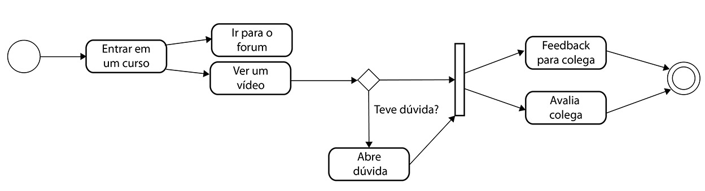

#### 6.0 Diagrama de Estados

- Diagrama de Estados: Documento que comunica entidades no sistema que seu estado varia.

    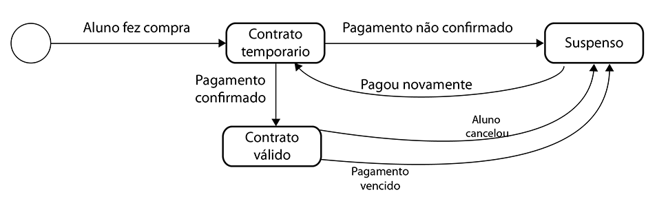

#### 7.0 Diagrama de Componentes

- Diagrama de Componentes: Documento que comunica como os sistemas conversam entre si.

    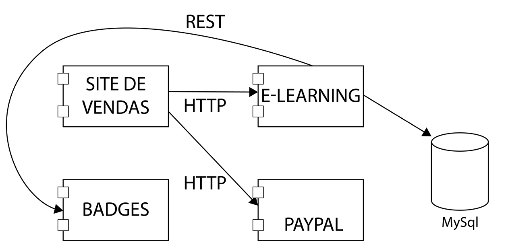

### UML: modelagem de diagramas

#### 1.0 Conceitos e Navegação Inicial

- Alternativa ao Astah é o Modelio (open source):

    [Modelio](https://www.modelio.org/)

- Conceitos de Orientação a Objetos e UML:

    - Orientação a Objetos é uma forma de você representar uma determinada realidade por meio de objetos, representação de uma realidade.

    - UML é uma linguagem de modelagem unificada que foca na representação de processos de forma a facilitar a comunicação entre as partes envolvidas em um projeto.

#### 2.0 Análise de Requisitos

- Diagramas de Estrutura (Área técnica): Representam características que são estáticas.

    - Classes
    - Objetos
    - Pacote
    - Estrutura Composta
    - Componentes
    - Implantação
    - Perfil

- Diagramas de Comportamento (Área de Negócios): Representam características que são dinâmicas ao logno do projeto.

    - Casos de Uso
    - Atividades
    - Máquina de Estado
    - Interação:
        
        - Sequeência
        - Comunicação
        - Tempo
        - Visão Geral

- Diagramas criados para análise dos requisitos: Diagrama de Classes e Diagrama de Casos de Uso

#### 3.0 Construção da Solução

- Conceitos de Mensagem: elemento base para representarmos a comunicação (envio e recebimento) de informações entre objetos.

    - Mensagens Síncronas: É aquela que é feita em sincronia, ou seja, a interação é feita em simultâneo. Precisa de um retorno para ser executada.

    - Mensagens Assíncronas: É aquela que não é feita em sincronia, ou seja, a interação não é feita em simultâneo. Não precisa de um retorno para ser executada.

- Diagramas criados para construção da solução: Diagrama de Atividades e Diagrama de Sequência

#### 4.0 Implantação da Solução

- Diagramas criados para implantação da solução: Diagrama de Máquinas de Estados e Diagrama de Componentes

#### 5.0 Validação e Ajustes da Solução

- Demarcar no projeto os agrupamentos que fazem parte de cada release.

- Ideia de passagem do modelo lógico para o modelo físico.

- A partir dos diagramas, se consegue desenhar um protótipo de telas.

### MS Project: planejado cronogramas de projeto

#### 1.0 Estruturando o projeto

- Para que se possa montar o cronograma alguns pressupostos tem que estar fechados:

    - Projeto e orçamento aprovados
    - Escopo mínimo fechado
    - Estrutura Analítica do Projeto (EAP) do projeto definida

- Alguns concorrentes do MS Project:

    - Jira
    - Asana
    - Trello
    - Click Up
    - Monday

- Estruturar de acordo com a EAP:

    - Definir fases
    - Definir tarefas
        - Expectativas de recursos e tempo podem variar de acordo com a senioridade de seu executor

    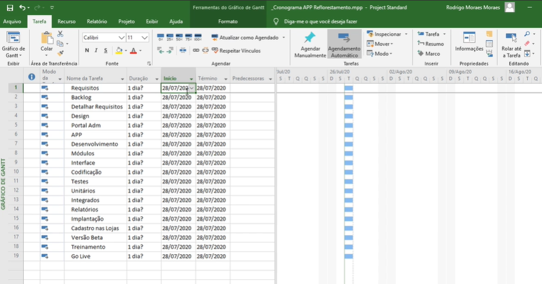

- Estruturar recursos do projeto (Pessoas e Ferramentas)

    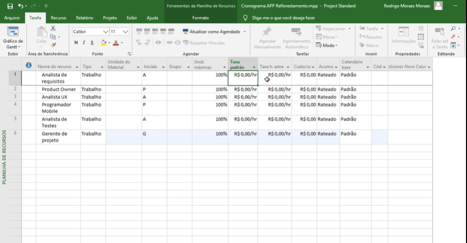

#### 2.0 Entendendo as visões do MS Project

- Uma vez estruturado Fases, Tarefas e Recursos/Responsáveis se refina o projeto:

    - Tarefas que tem vínculos (Relacionamento entre tarefas e latências)
        - Notações de vínculo:

            - Término Início(TI): Uma tarefa inicia quando outra terminar
            - Início Início(II): Uma tarefa inicia quando outra iniciar 

    - Ajuste dos tempos de execução e prazos

    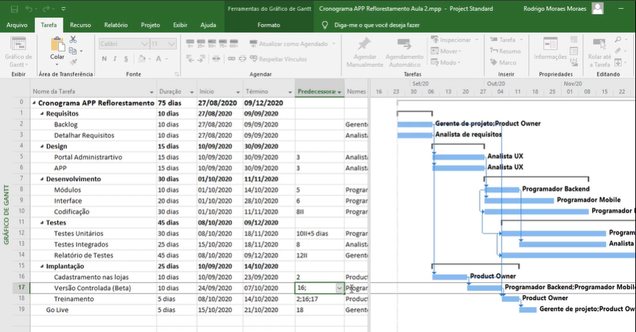

    - Obs.: Cuidados com as superalocações ao definir prazos e responsáveis

    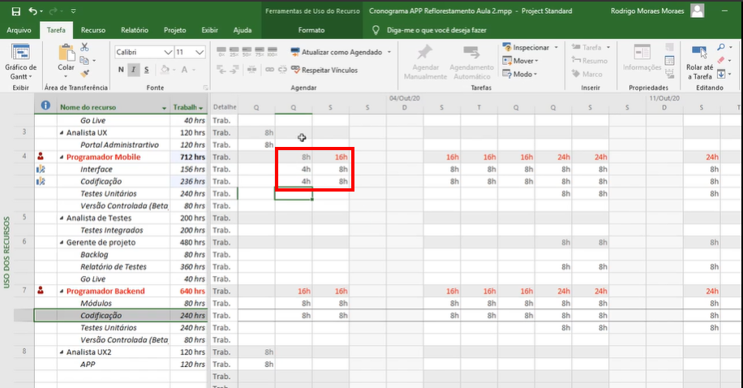

- Com esses pontos definidos, o projeto já pode ser apresentado minimamente, com prazos e custos bem definidos.

#### 3.0 Calendário do MS Project

- Importância de alocar feriados no calendário (impacto no prazo de entrega) para mitigar riscos.

- Fatores que impactam no calendário:

    - Disponibilidade de recursos
    - Período de execução da tarefa (possíveis problemas em tempo de execução que podem gerar atraso)
    - Concorrência entre projetos (mais de um projeto em paralelo usando os mesmos recursos)

- Obs.: Cuidar sempre para calendários padrões para ser compartilhados e serem de fácil compartilhamento entre projetos

#### 4.0 Novas Tarefas, Recursos e Custos

- Novas tarefas geram novos prazos e custos para o projeto.

#### 5.0 Gerando o cronograma base do projeto

- Uma vez definidos os pontos se geram relatórios de custos, prazos e recursos:

    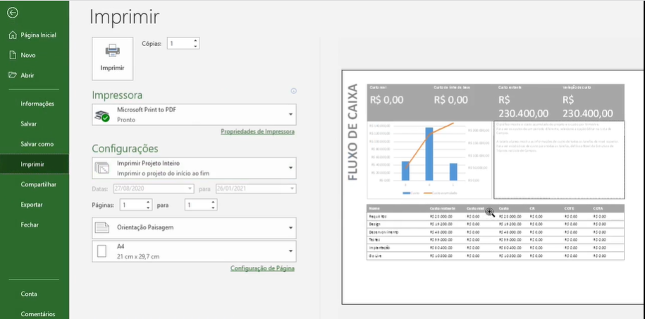

- Linha base gerada é uma linha que demonstra a ideia de cronograma inicial e que ficará acompanhando o projeto com o realizado (adiantado ou atrasado).

    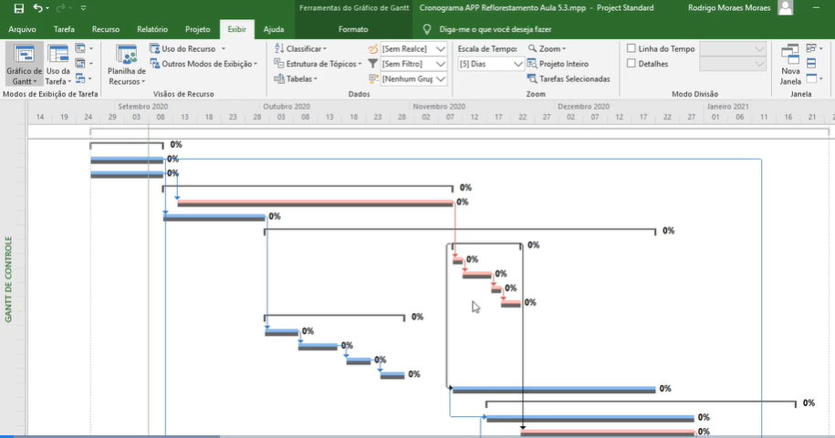

- Caminhos e tarefas críticas devem ser observadas, pois uma vez iniciadas, elas podem, por qualquer tipo de atraso gerar atrasos na entrega do projeto.