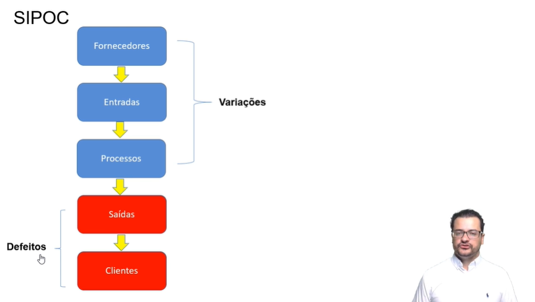
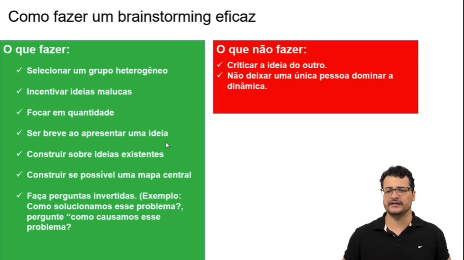
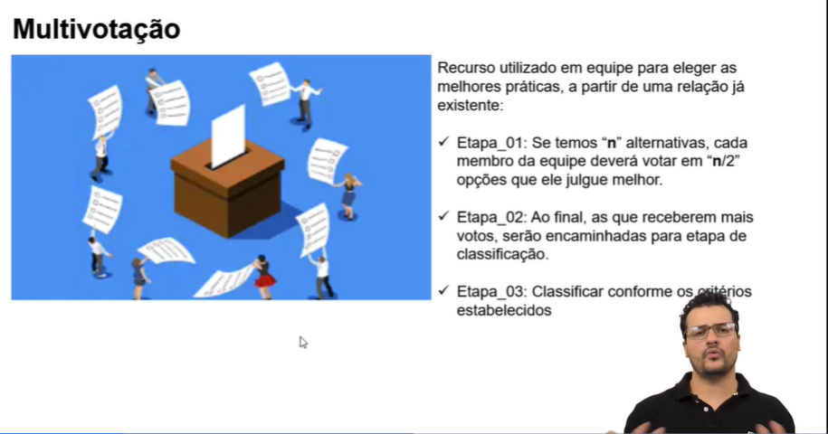

# Tópicos sobre Análise e aplicação de melhorias

## Conteúdo dos módulos de treinamento

### Diagnóstico em gestão de processos: entendendo as necessidades

#### 1.0 Entendimento inicial do processo

- Ferramenta VOC(Voice of Customer): É um instrumento altamente eficaz para medição e atuação sobre a satisfação do cliente em relação aos serviços oferecidos, são requisitos críticos do cliente.

- Ferramenta VOB(Voice of Bussines) ou VOP(Voice of Process): É extremamente importante o alinhamento do VOC com o VOB, **variação entre as expectativa do seu cliente e o que você consegue entregar** é a voz do seu processo, ou seja o VOB.

- Mapa estratégico: O mapa estratégico transforma o planejamento em ações práticas, ele auxilia na tomada de decisão para o seu negócio, ele também traduz a missão e a estratégia da empresa num conjunto de medidas de desempenho. E ainda tem foco no futuro e no estabelecimento de uma sistemática de melhoria contínua do seu negócio. Essa ferramenta foi criada por Norton e Kaplan,sobre 4 perspectivas, pois antigamente as organizações estavam preocupadas somente com a saúde financeira do seu negócio.

    - Perspectivas do mapa do mapa estratégico:

        - Finanças.
        - Clientes.
        - Processos Internos.
        - Aprendizado e Crescimento.

- Payback do projeto: Tempo para pagamento de retorno do investimento realizado. Payback (anos) = Valor do investimento / Benefícios Anuais

#### 2.0 Construindo o processo

- Técnicas para levantamento de requisitos de processos:

    - Entrevistas
    - Observação In Loco
    - Pesquisa de Satisfação

- SIPOC: Ferramenta utilizada para mapear processos. Usada para definir fronteiras de estudo do processo, entregar um conhecimento macro, base para discussão de novos processos e concenso entre a equipe.

    - S: Supplier (fornecedores)
    - I: Input (entradas)
    - P: Process (Processos)
    - O: Output (Saídas)
    - C: Customer (Clientes)

- Passos para preparar um SIPOC:

    1. Definir o nome do processo
    2. Definir as saídas do processo
    3. Definir os clientes do processo
    4. Definir as entradas do processo
    5. Definir os fornecedores do processo
    6. Definir as macroatividades do processo

- Definindo indicadores KPI(Key Performance Indicators):

    - Pilar Eficiência: São os indicadores que seguem as regras, porém eles se preocupam com a eficiência dos recursos, ou seja, fazem mais com menos.

    - Pilar Eficácia: Buscam diretamente os resultados, não se importando com as regras, resumindo: ênfase nos resultados, em atingir os objetivos.

    - QFD(Quality Function Deployment): Tem como objetivo permitir que a equipe identifique e priorize os indicadores de performance mais importantes para a melhoria da organização.

    - Importante formalizar um indicador, especificando em uma ficha técnica o que se espera dele de forma clara e objetiva.

    - Para se definir uma meta é importante a utilização do acrônimo SMART: 
        
        - S – Específico (Em relação ao impacto do problema) 
        - M - Mensurável (O impacto pode ser quantificado) 
        - A- Atingível (isto é, o objetivo é razoável) – Você não poderá colocar metas inalcançáveis para o projeto, pois isso poderá deixar toda equipe frustrada, pois não conseguirão atingir as metas. 
        - R – Relevante (Para o cliente e para o negócio) 
        - T – Tempo de realização (Quando se espera que o objetivo seja alcançado)

#### 3.0 Analisando o fluxo de valor do processo

- Importante em cada processo identificar os Xs (Entradas) e os Ys (Saídas) de cada etapa do processo, ajudando assim a encontrar a causa raíz de possíveis problemas. (Mapa de Processos)

- Para que se tenha informações e subsídios para identificar as variáveis de um processo é importante se possuir um bom plano de medições, estipulando as etapas e atores da coleta de dados. (Plano de Coleta de Dados)

#### 4.0 Técnicas e ferramentas para encontrar a causa raíz

- Diagrama de Pareto: O conceito de Pareto diz a regra 80/20 que significa 80% dos seus resultados, vem de 20% das ações realizadas.

    - Passos para montar um gráfico de Pareto: Identificar qual é o problema; levantar os tipos de defeitos e quantificar; calcular o % de ocorrências; calcular o % de acumulo; plotar o gráfico

- Diagrama de Ishikawa: Uma ferramenta visual que serve para organizar as informações, a fim de estabelecer e esclarecer as relações entre o efeito e suas causas principais.

- Ferramenta 5 Porquês: O “5 porquês” é uma técnica para encontrar a causa raiz de um defeito ou problema. Esta ferramenta é muito usada na área de qualidade, mas na prática se aplica em qualquer área.

#### 5.0 Priorização das necessidades

- Matriz GUT(Gravidade, Urgência e Tendência): É uma ferramenta que auxilia na priorização de resolução de problemas e é por isso que ela é conhecida como matriz de prioridades.

### Análise da gestão de processos: implantando melhorias

#### 1.0 Planejamento de planos de ação

- Levantamento e escolha de ideias para soluções:

    - Brainstorming: Levantamento de ideias para possíveis soluções. Objetivo de levantamento do maior número de ideias possível (limite um tempo para isso).

        

    - Multivotação: Escolha das melhores ideias.

        

#### 2.0 Modelos para otimização de resultados

- Solver: é um suplemento do Microsoft Excel que você pode usar para teste de hipóteses. Use o Solver para encontrar um valor ideal (máximo ou mínimo) para uma fórmula em uma célula — conforme restrições, ou limites, sobre os valores de outras células de fórmula em uma planilha.

- Break Even: Ponto de equilíbrio de uma organização. Mostra o quanto é necessário vender para que a receita se iguale aos custos. (Gerenciador de metas do excel ajuda a encontrar esse valor)

#### 3.0 Plano de implementação

- Planos de ação:

    - 5w2h: 

        - What - o que será feito?
        - When - quando será feito.
        - Who - quem fará.
        - Why - Por que será feito?
        - Where - onde será feito.
        - How - como será feito.
        - How much - quanto custará?

    - Matriz Esforço x Impacto: A matriz de esforço e impacto é dividida em quatro quadrantes, classificando-os de acordo com o impacto gerado e o esforço despendido para executá-lo.

#### 4.0 Gerenciamento de mudanças

- Para implementação da Gestão de Mudanças, alguns pilares são muito importantes:

    - Comunicação clara da visão e necessidades das mudanças
    - Envolvimento dos colaboradores em cada uma das fases de mudança
    - Reconhecimento e recompensas por novos comportamentos
    - Comemoração a cada conquista
    - Avaliação dos resultados das melhorias implementadas

- Comprovações de melhorias:

    - Eficácia: Concluíu-se as etapas do plano de ação?
    - Efetividade: Qual foi o impacto no processo
    - KPI: Quais impactos nos indicadores iniciais propostos?